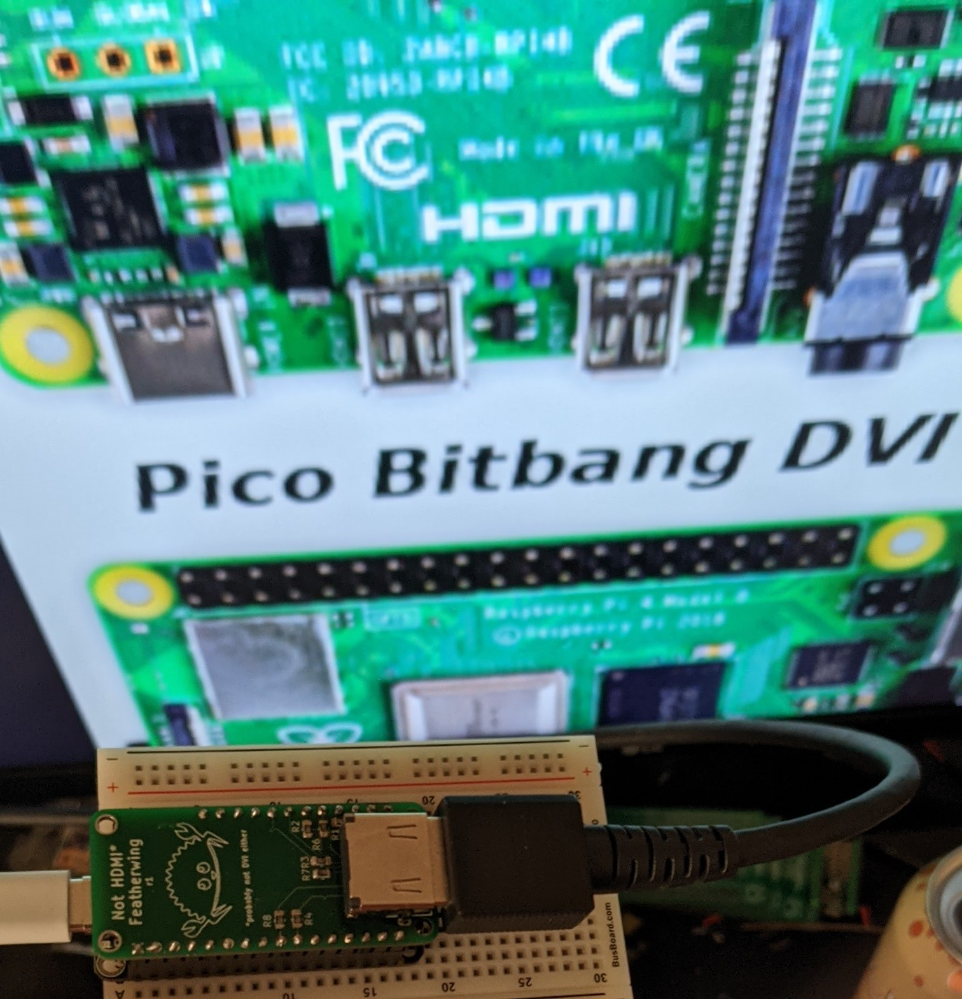

# Not HDMI Featherwing

A Featherwing (intended for the Adafruit Feather RP2040, though it might work with the Sparkfun Thing Plus RP2040 too) for DVI video output.

A compatible PicoDVI fork is at https://github.com/leo60228/PicoDVI/tree/not-hdmi-featherwing.
